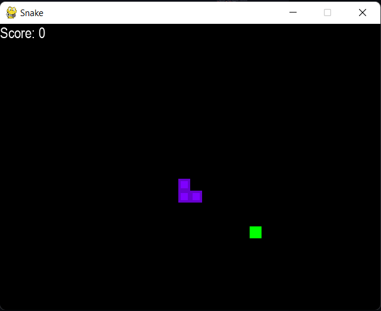

# Trained Snake 🐍
- Imagine a computer playing Snake game better than a Human. With that thought, I developed this project....
- I created the project using `pygame` and Reinforcement learning.
- Reinforcement learning is a type of machine learning that enables an agent to learn in an environment by trial and error using feedback from its own actions and experiences.
- First I created the classic Snake Game using Python and Pygame. Then I created and train a neural network using PyTorch that can play the game better than most humans.
- Deep Q Learning is used to train the model, QNet and QTrainer is used to train the model though the use of Pytorch.

### Initial setup of the Project

### Intermediate State of the Training

### Final State of the Model
- After around thirty minutes and 450 games, I found the accuracy score of 47 which is very complex for a human to reach.

